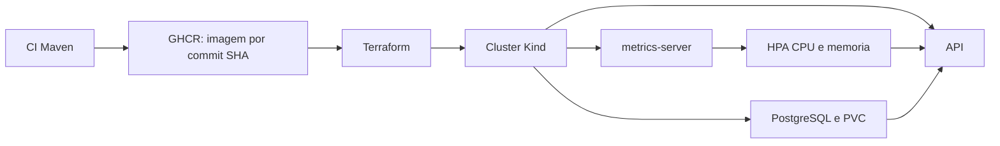

# FIAP SOAT - Mecanica do Braia

API REST desenvolvida para gerenciamento de uma oficina mecanica, como parte do
**Tech Challenge - Fase 1**.

## Problema

O sistema foi idealizado para resolver dores comuns de oficinas mecanicas:

- Erros na priorizacao dos atendimentos
- Falhas no controle de pecas e insumos
- Dificuldade em acompanhar o status dos servicos
- Perda de historico de clientes e veiculos
- Ineficiencia no fluxo de orcamentos e ordens de servico

## Tecnologias

- Java 21
- Spring Boot 3.5
- Spring Web
- Spring Data JPA
- Spring Mail
- Spring Security
- JWT
- PostgreSQL 17
- Flyway
- Maven
- Docker e Docker Compose
- MailHog
- Kubernetes
- Spring Boot Actuator
- Swagger/OpenAPI
- JUnit, Mockito, Testcontainers e MockMvc
- JaCoCo
- SonarQube
- ZAP by Checkmarx
- GitHub Actions

## Arquitetura

O projeto segue uma organizacao inspirada em Clean Architecture e Arquitetura Hexagonal.

```text
src/main/java/br/com/fiap/soat/mecanica
|-- domain                  -> regras de negocio, entidades, enums, value objects e portas
|-- application             -> casos de uso da aplicacao
|-- adapters
|   |-- in/web              -> controllers, DTOs, mappers e filtro de seguranca
|   `-- out
|       |-- persistence     -> entidades JPA, repositories e mappers de persistencia
|       |-- notification    -> adapter SMTP para notificacoes por e-mail
|       `-- security        -> servicos de JWT e criptografia de senha
`-- config                  -> seguranca, OpenAPI e tratamento global de excecoes
```

## Principais dominios

- **Usuario:** representa os usuarios autenticados da API.
- **Cliente:** pessoa fisica ou juridica atendida pela oficina.
- **Veiculo:** veiculo associado a um cliente.
- **Servico:** tipo de servico executado pela oficina.
- **Peca:** item de estoque utilizado nos servicos.
- **Ordem de Servico:** entidade central do fluxo de atendimento.
- **Prestacao de Servico:** servico incluido em uma ordem de servico.
- **Alocacao de Peca:** reserva/uso de uma peca em uma prestacao de servico.

## Fluxo da Ordem de Servico

A Ordem de Servico controla o ciclo de vida do atendimento:

```text
RECEBIDA
EM_DIAGNOSTICO
AGUARDANDO_APROVACAO
EM_EXECUCAO
FINALIZADA
ENTREGUE
```

Fluxo principal:

1. O mecanico cria uma Ordem de Servico.
2. O mecanico adiciona uma Prestacao de Servico.
3. A OS sai de `RECEBIDA` para `EM_DIAGNOSTICO`.
4. O almoxarife aloca pecas na prestacao.
5. O sistema baixa estoque e soma o valor das pecas no total da OS.
6. O mecanico envia a OS para aprovacao.
7. O mecanico inicia a execucao.
8. Ao finalizar todas as prestacoes, a OS passa para `FINALIZADA`.
9. Ao pagar, a OS passa para `ENTREGUE`.

## Listagem operacional de ordens de servico

O endpoint abaixo apresenta a fila ativa de trabalho da oficina:

```http
GET /ordem-servicos?page=0&size=20
Authorization: Bearer <token-do-mecanico>
```

O acesso e restrito ao perfil `MECANICO`. Os parametros sao:

| Parametro | Padrao | Restricao |
| --- | ---: | --- |
| `page` | `0` | zero ou maior |
| `size` | `20` | entre `1` e `100` |

Valores invalidos retornam `400 Bad Request`. Uma pagina sem registros retorna
`200 OK` com `content` vazio.

A consulta e executada e paginada no PostgreSQL. Ela retorna somente OS com
`status = ATIVO` nas situacoes abaixo, nesta ordem de prioridade:

1. `EM_EXECUCAO`
2. `AGUARDANDO_APROVACAO`
3. `EM_DIAGNOSTICO`
4. `RECEBIDA`

Dentro da mesma situacao, as OS sao ordenadas por `dataRecebida ASC` e, em caso
de empate, por `id ASC`. Ordens `FINALIZADA`, `ENTREGUE` ou com status `INATIVO`
nao aparecem na fila, mas continuam persistidas e acessiveis pelos demais
fluxos. Nao ha exclusao fisica.

Exemplo de resposta:

```json
{
  "content": [
    {
      "id": "66666666-6666-6666-6666-666666666666",
      "status": "ATIVO",
      "situacao": "EM_EXECUCAO",
      "dataRecebida": "2026-07-13T10:00:00",
      "dataDiagnostico": "2026-07-13T10:30:00",
      "dataAguardandoAprovacao": "2026-07-13T11:00:00",
      "dataExecucao": "2026-07-13T11:30:00",
      "dataFinalizada": null,
      "dataEntregue": null,
      "pago": false,
      "valorTotal": 150.00,
      "observacao": "Revisao preventiva",
      "veiculoId": "44444444-4444-4444-4444-444444444444",
      "usuarioId": "22222222-2222-2222-2222-222222222222"
    }
  ],
  "page": 0,
  "size": 20,
  "totalElements": 1,
  "totalPages": 1,
  "first": true,
  "last": true
}
```

`status` representa se o registro esta ativo ou inativo. `situacao` representa
a etapa operacional da OS. O endpoint publico existente
`GET /ordem-servicos/veiculo/placa/{placa}` foi preservado sem alteracoes de
contrato ou seguranca.

## Notificacoes de status por e-mail

As notificacoes usam uma porta de saida da camada de aplicacao e um adapter SMTP
baseado em Spring Mail. Os casos de uso existentes continuam responsaveis pelas
regras de transicao. Depois da persistencia, a aplicacao resolve o destinatario
pelo caminho OS -> veiculo -> cliente e agenda o envio para depois do commit da
transacao. O dominio nao conhece SMTP nem `JavaMailSender`.

Uma mensagem de texto simples e enviada nas transicoes:

- `RECEBIDA` -> `EM_DIAGNOSTICO`
- `EM_DIAGNOSTICO` -> `AGUARDANDO_APROVACAO`
- `AGUARDANDO_APROVACAO` -> `EM_DIAGNOSTICO`
- `AGUARDANDO_APROVACAO` -> `EM_EXECUCAO`
- `EM_EXECUCAO` -> `FINALIZADA`
- `FINALIZADA` -> `ENTREGUE`

Nao ha envio na criacao inicial da OS, no cancelamento, quando a situacao nao
muda, quando a transicao/persistencia falha ou quando somente parte das
prestacoes e finalizada.

O MailHog e usado somente em desenvolvimento e validacoes locais. Ele captura
as mensagens e nao as entrega a caixas de e-mail reais. A interface fica em
`http://localhost:8025` e o SMTP em `localhost:1025`.

O assunto segue o formato `Atualização da ordem de serviço {id}` e o corpo
informa o nome do cliente, o identificador da OS e as situações anterior e nova
com descrições amigáveis (`Recebida`, `Em diagnóstico`, `Aguardando aprovação`,
`Em execução`, `Finalizada` e `Entregue`).

Configuracoes externalizadas:

| Variavel | Padrao local | Descricao |
| --- | --- | --- |
| `EMAIL_NOTIFICATIONS_ENABLED` | `true` | habilita/desabilita notificacoes |
| `EMAIL_FROM` | `no-reply@mecanica.local` | remetente das mensagens |
| `SPRING_MAIL_HOST` | `localhost` | host SMTP; no Compose usa `mailhog` |
| `SPRING_MAIL_PORT` | `1025` | porta SMTP |
| `SPRING_MAIL_USERNAME` | vazio | usuario SMTP, se exigido fora do MailHog |
| `SPRING_MAIL_PASSWORD` | vazio | senha SMTP, sempre fornecida externamente |
| `SPRING_MAIL_PROPERTIES_MAIL_SMTP_AUTH` | `false` | autenticacao SMTP |
| `SPRING_MAIL_PROPERTIES_MAIL_SMTP_STARTTLS_ENABLE` | `false` | STARTTLS |
| `SPRING_MAIL_PROPERTIES_MAIL_SMTP_CONNECTIONTIMEOUT` | `5000` | timeout de conexao em ms |
| `SPRING_MAIL_PROPERTIES_MAIL_SMTP_TIMEOUT` | `5000` | timeout de leitura em ms |
| `SPRING_MAIL_PROPERTIES_MAIL_SMTP_WRITETIMEOUT` | `5000` | timeout de escrita em ms |

Nenhuma credencial real deve ser versionada. No perfil de testes, as
notificacoes ficam desabilitadas e `JavaMailSender` e mockado nos testes do
adapter, portanto a suite nao abre conexao SMTP.

Falhas de resolucao do destinatario ou de envio sao registradas com o ID da OS e
o tipo da excecao, sem credenciais ou dados sensiveis. Elas nao revertem a
atualizacao nem alteram a resposta HTTP de sucesso. Esta versao nao implementa
retry automatico, fila, Outbox Pattern ou envio assincrono.

## Perfis de acesso

A API utiliza JWT e autorizacao por cargo.

| Cargo | Responsabilidades principais |
| --- | --- |
| `ATENDENTE` | Cadastro e consulta de clientes e veiculos |
| `MECANICO` | Cadastro de servicos, ordens de servico, prestacoes e fluxo da OS |
| `ALMOXARIFE` | Cadastro de pecas e alocacao de pecas em prestacoes |

Rotas publicas:

- `POST /usuarios`
- `POST /auth/login`
- `GET /ordem-servicos/veiculo/placa/{placa}`
- Swagger/OpenAPI

As demais rotas exigem token JWT.

## Pre-requisitos

Antes de rodar o projeto, instale:

- Java 21
- Maven 3.9+ ou use o Maven Wrapper do projeto
- Docker Desktop com o daemon ativo
- Docker Compose
- Terraform >= 1.14.5 e < 1.16.0 para o ambiente Kind
- `kubectl` para observabilidade do cluster

## Como rodar

Existem duas formas de executar o projeto. Use apenas uma delas por vez:

- **Aplicacao local + banco no Docker:** suba somente o PostgreSQL pelo Docker e
  rode a API pela IDE ou pelo Maven.
- **Tudo via Docker Compose:** suba a API e os demais servicos pelo Docker.

> Atencao: o comando `docker-compose up -d` tambem sobe a API no container
> `mecanica-api` usando a porta `8080`. Se a API ja estiver rodando pelo Docker,
> nao execute a aplicacao tambem pela IDE/Maven na mesma porta, pois ocorrera o
> erro `Port 8080 was already in use`.

Antes de usar o Docker Compose, crie o arquivo local de variaveis e troque
todos os placeholders. Esse arquivo e ignorado pelo Git:

```bash
cp .env.example .env
```

### 1. Subir somente o banco PostgreSQL

Use este modo quando quiser rodar a aplicacao localmente pela IDE ou pelo Maven.

```bash
docker-compose up -d postgres
```

O PostgreSQL fica disponivel em:

```text
localhost:5433
```

Configuracao local:

```text
database: mecanica
username: postgres
password: definida em DB_PASSWORD no arquivo .env local
```

### 2. Rodar a aplicacao localmente

Ao executar pela IDE ou Maven, forneca `SPRING_DATASOURCE_PASSWORD` e
`JWT_SECRET` no ambiente do processo. O segredo JWT deve estar em Base64 e
nao deve ser versionado.

No Windows:

```bash
./mvnw.cmd spring-boot:run
```

No Linux/macOS:

```bash
./mvnw spring-boot:run
```

A API ficara disponivel em:

```text
http://localhost:8080
```

### 3. Subir tudo via Docker Compose

Este comando constroi e sobe a API, o PostgreSQL, o MailHog, o SonarQube e o
banco do SonarQube:

```bash
docker compose up --build -d
```

Servicos principais:

```text
API:        http://localhost:8080
PostgreSQL: localhost:5433
MailHog UI: http://localhost:8025
MailHog SMTP: localhost:1025
SonarQube:  http://localhost:9000
```

Neste modo, a API ja fica disponivel em `http://localhost:8080` pelo container
`mecanica-api`. Nao e necessario iniciar a aplicacao pela IDE/Maven.

Para rodar a API localmente com PostgreSQL e MailHog no Docker:

```bash
docker compose up -d postgres mailhog
./mvnw.cmd spring-boot:run
```

### Como validar manualmente

1. Execute `docker compose up --build -d` e aguarde a API e o PostgreSQL.
2. Autentique em `POST /auth/login` com um usuario `MECANICO`.
3. Crie ou localize uma OS e execute uma das transicoes existentes.
4. Acesse `http://localhost:8025` e confirme assunto, destinatario e conteudo.
5. Chame `GET /ordem-servicos?page=0&size=20` com o token do mecanico.
6. Confirme o filtro e a ordem por situacao, `dataRecebida` e `id`.
7. Consulte `GET /ordem-servicos/veiculo/placa/{placa}` para validar que o fluxo
   publico por placa continua disponivel.
8. Ao terminar, execute `docker compose down`.

### 4. Subir somente o SonarQube

Use este modo quando a aplicacao ja estiver rodando localmente pela IDE/Maven e
voce quiser subir apenas o SonarQube e o banco dele:

```bash
docker-compose up -d sonarqube
```

O SonarQube fica disponivel em:

```text
http://localhost:9000
```

Na primeira execucao, aguarde alguns instantes ate o servico finalizar a
inicializacao e altere imediatamente as credenciais iniciais solicitadas pela
interface.

Para verificar o status do SonarQube:

```text
http://localhost:9000/api/system/status
```

Quando o retorno indicar `status: UP`, a interface ja pode ser acessada.

## Infraestrutura local com Terraform e Kind

O Terraform e o unico responsavel por criar o cluster Kind e aplicar os YAMLs
de `k8s/`. O ambiente inclui o namespace `mecanica`, PostgreSQL com PVC, API,
metrics-server e HPA. O NodePort `30080` e encaminhado pelo Kind para
`http://localhost:8080`.



Crie as variaveis locais a partir do exemplo e substitua somente os
placeholders. `terraform.tfvars`, state e kubeconfig sao ignorados pelo Git:

```bash
cd infra
cp terraform.tfvars.example terraform.tfvars
terraform init
terraform fmt -check -recursive
terraform validate
terraform plan -out=local.tfplan
terraform apply local.tfplan
```

`api_image` deve apontar para uma imagem publica e imutavel no formato
`ghcr.io/<owner>/<repo>:<commit_sha>`. Os valores `db_password` e `jwt_secret`
sao sensiveis; o Terraform gera os objetos `Secret` sem manter valores reais
nos YAMLs. Como esses valores existem no state local, proteja o arquivo de
state e nunca o versione.

Depois do `apply`, use `kubectl` apenas para observar e validar:

```bash
export KUBECONFIG="$PWD/kubeconfig"
kubectl get all,pvc -n mecanica
kubectl rollout status deployment/mecanica-db -n mecanica
kubectl rollout status deployment/mecanica-api -n mecanica
kubectl top pods -n mecanica
kubectl describe hpa/mecanica-api-hpa -n mecanica
curl http://localhost:8080/actuator/health/readiness
```

Finalize o ambiente explicitamente:

```bash
terraform destroy
```

O destroy remove o cluster e o PVC interno; portanto, os dados do PostgreSQL
sao perdidos. Localmente, o cluster pode ficar ativo ate esse comando. No
GitHub Actions ele e efemero e o `destroy` roda sempre ao final. Consulte o
guia detalhado em [`infra/README.md`](infra/README.md).

## Swagger

Com a aplicacao rodando, acesse:

```text
http://localhost:8080/swagger-ui.html
```

O Swagger esta configurado com autenticacao Bearer JWT.

## Autenticacao

### Criar usuario

```http
POST /usuarios
Content-Type: application/json
```

Exemplo:

```json
{
  "nome": "Mecanico Teste",
  "email": "mecanico@email.com",
  "senha": "Senha@123",
  "cargoEnum": "MECANICO"
}
```

### Fazer login

```http
POST /auth/login
Content-Type: application/json
```

Exemplo:

```json
{
  "email": "mecanico@email.com",
  "senha": "Senha@123"
}
```

### Usar o token

Envie o token retornado no header:

```http
Authorization: Bearer SEU_TOKEN
```

## Usuarios mockados

A migration `V9__mock_dados.sql` cria usuarios para facilitar testes manuais.

| Cargo | Email | Senha |
| --- | --- | --- |
| `ATENDENTE` | `atendente@mecanica.test` | `Senha@123` |
| `MECANICO` | `mecanico@mecanica.test` | `Senha@123` |
| `ALMOXARIFE` | `almoxarife@mecanica.test` | `Senha@123` |

## Banco de dados

O banco e versionado com Flyway em:

```text
src/main/resources/db/migration
```

Principais tabelas:

- `usuarios`
- `clientes`
- `veiculos`
- `pecas`
- `servicos`
- `ordem_servicos`
- `prestacao_servicos`
- `alocacao_pecas`

## Melhorias de Infraestrutura e Testes

- **Dockerfile multi-stage:** a imagem agora compila a aplicação em um stage com Maven e JDK e copia apenas o `.jar` gerado para uma imagem runtime menor com JRE. O build Docker e autocontido e não depende de um artefato gerado localmente.
- **Usuario nao-root:** o stage final cria usuário e grupo dedicados para a aplicação, copia o artefato com permissão adequada e executa o processo Java com `USER mecanica`.
- **Healthcheck do banco:** o PostgreSQL no Docker Compose usa `pg_isready` para indicar quando o banco está pronto para conexões.
- **Ordem de subida no Compose:** a aplicação depende do PostgreSQL com `condition: service_healthy`, evitando tentativas de conexão antes do banco estar saudável.
- **Testcontainers nos testes de integracao:** os testes JPA e de contexto sobem PostgreSQL real com Testcontainers e injetam dinâmicamente `spring.datasource.url`, `spring.datasource.username`, `spring.datasource.password` e `spring.datasource.driver-class-name`.
- **Banco real nos testes:** Flyway, Hibernate/JPA e repositories são validados contra PostgreSQL, mantendo os testes unitários independentes de container.

## Testes

Rodar testes:

```bash
./mvnw.cmd test
```

No Linux/macOS:

```bash
./mvnw test
```

> Os testes de integração usam Testcontainers. Mantenha o Docker em execução antes de rodar a suíte completa.

Rodar verificação completa com JaCoCo:

```bash
./mvnw.cmd clean verify
```

O projeto possui testes para:

- Entidades de dominio
- Value Objects
- Casos de uso
- Controllers
- Mappers
- Repositories
- Seguranca/JWT
- Tratamento global de excecoes

O relatorio de cobertura fica em:

```text
target/site/jacoco/index.html
```

Atualmente, o projeto exige cobertura minima de **80%** no `mvn verify`.

## Smoke test da API

Existe um script de smoke test em:

```text
tests/api-smoke/api-smoke.mjs
```

Com a aplicacao rodando:

```bash
node .\tests\api-smoke\api-smoke.mjs
```

Tambem e possivel apontar para outra URL:

```bash
API_BASE_URL=http://localhost:8080 node tests/api-smoke/api-smoke.mjs
```

## Analise de seguranca com ZAP by Checkmarx

O projeto pode ser analisado com o ZAP by Checkmarx instalado localmente para
verificacao dinamica de vulnerabilidades na API em execucao.

Com a aplicacao rodando, configure o alvo no aplicativo:

```text
http://localhost:8080
```

Porém para que seja possível acessar Endpoints autorizados, é nesserario acessar com um token JWT no header.
A maioria dos Endpoint possui um PreAuthorize especificando qual Cargo tem acesso.

## CI/CD

O projeto possui pipeline no GitHub Actions em:

```text
.github/workflows/ci.yml
.github/workflows/cd.yml
```

A CI executa:

- Checkout do repositorio
- Setup do JDK 21
- `./mvnw clean verify`
- Analise SonarQube quando `SONAR_TOKEN` e `SONAR_HOST_URL` estiverem configurados

Depois de uma CI bem-sucedida em `main`, o CD usa exatamente o
`workflow_run.head_sha`: publica `ghcr.io/<owner>/<repo>:<sha>`, executa
`terraform fmt/init/validate/plan/apply`, valida banco, API, metrics-server,
HPA e smoke test, e finalmente executa `terraform destroy` com `always()`.

Configure os GitHub Secrets `DB_PASSWORD` e `JWT_SECRET`. O pacote Container
no GHCR deve ter visibilidade publica; isso e verificado por um pull anonimo
antes do provisionamento. O token JWT deve ser fornecido em Base64.

## Padroes utilizados

- Clean Architecture
- Arquitetura Hexagonal
- SOLID
- Separacao entre dominio e persistencia JPA
- Value Objects para validacoes de CPF, CNPJ, Email, Placa, Senha e Telefone
- Repositories como portas do dominio
- Use cases para orquestracao das regras de aplicacao
- DTOs e mappers nos adapters de entrada e saida
- Tratamento global de excecoes
