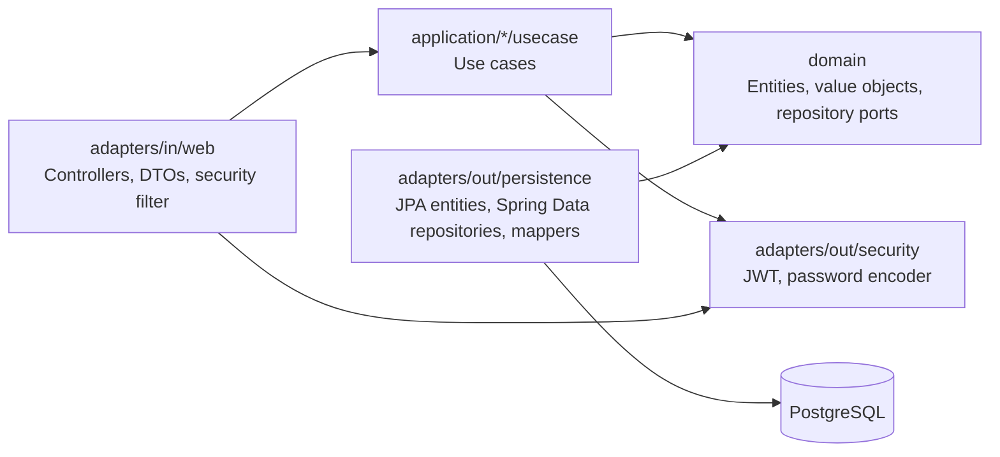

# Technical Onboarding - Tech Challenge Oficina

## 1. Visao geral

Este repositorio contem um backend monolitico Java/Spring Boot para o Tech Challenge Fase 1. O escopo implementado ainda e inicial: autenticacao JWT, cadastro de usuario e parte do modulo de veiculos. Existem classes iniciadas para clientes, mas o fluxo esta incompleto e ha codigo-fonte sintaticamente quebrado em `src/main/java/br/com/fiap/soat/mecanica/application/cliente/usecase/CadastrarClienteUseCase.java`.

O projeto tenta seguir uma separacao por camadas inspirada em Clean Architecture/Hexagonal:



Estado geral: **parcial e nao pronto para evolucao funcional sem correcao de build e estabilizacao dos modulos base**.

## 2. Stack identificada

| Item | Stack real | Evidencia |
|---|---|---|
| Linguagem | Java 21 | `pom.xml` define `<java.version>21</java.version>` |
| Framework | Spring Boot 3.5.14 | `pom.xml`, parent `spring-boot-starter-parent` |
| Web/API | Spring MVC | `spring-boot-starter-web`, controllers em `adapters/in/web` |
| ORM | Spring Data JPA / Hibernate | `spring-boot-starter-data-jpa`, entidades JPA em `adapters/out/persistence` |
| Banco | PostgreSQL 17 em runtime, H2 em testes | `docker-compose.yml`, `application.properties`, `application-test.properties` |
| Migrations | Flyway | `src/main/resources/db/migration/*.sql` |
| Auth | Spring Security + JWT | `SecurityConfig`, `JwtAuthenticationFilter`, `JwtService` |
| Hash de senha | BCrypt | `PasswordEncoderAdapter` usa `BCryptPasswordEncoder` |
| Validacao | Bean Validation + Value Objects | DTOs com `@NotBlank`, `@Email`; VOs `CPF`, `CNPJ`, `Placa`, `Email`, `Telefone` |
| Swagger/OpenAPI | springdoc-openapi | `springdoc-openapi-starter-webmvc-ui`, `OpenApiConfig` |
| Testes | JUnit/Spring Boot Test | `spring-boot-starter-test`, unico teste `contextLoads` |
| Build | Maven Wrapper | `mvnw`, `mvnw.cmd`, `pom.xml` |
| Lint/format | Ausente | Nao ha Checkstyle, Spotless, PMD, Error Prone ou formatter configurado |
| Coverage | Ausente | Nao ha JaCoCo ou plugin equivalente |
| Docker | Dockerfile + docker-compose | `dockerfile`, `docker-compose.yml` |

Observacao de setup: o ambiente local analisado usa Java 17 (`java -version`), mas o projeto exige Java 21. `.\mvnw.cmd test` falhou com `release version 21 not supported`.

## 3. Estrutura do projeto

```text
src/main/java/br/com/fiap/soat/mecanica
├── adapters
│   ├── in/web
│   │   ├── auth        # AuthController, DTOs de login
│   │   ├── cliente     # Controller vazio, DTOs, mapper de response
│   │   ├── security    # JwtAuthenticationFilter, CustomUserDetailsService
│   │   ├── usuario     # UsuarioController, DTOs, mapper de response
│   │   └── veiculo     # VeiculoController, DTOs, mapper de response
│   └── out
│       ├── persistence # Entidades JPA, repositories Spring Data, mappers
│       └── security    # JwtService, PasswordEncoderAdapter
├── application
│   ├── cliente/usecase # Casos de uso de cliente, incompletos
│   ├── usuario/usecase # Cadastro, busca por email, auth placeholder, password port
│   └── veiculo/usecase # Cadastro e busca por id
├── config              # SecurityConfig, OpenApiConfig, GlobalExceptionHandler
└── domain              # Entidades de dominio, VOs, enums, repository ports
```

Locais principais:

| Responsabilidade | Local atual | Observacao |
|---|---|---|
| Controllers/routes | `src/main/java/.../adapters/in/web/*/*Controller.java` | `AuthController`, `UsuarioController`, `VeiculoController`; `ClienteController` vazio |
| Services/use cases | `src/main/java/.../application/*/usecase` | Classes anotadas com `@Service` |
| Entidades de dominio | `src/main/java/.../domain` | `Usuario`, `Veiculo`, `Cliente`, `Principal`, VOs |
| Repositories de dominio | `src/main/java/.../domain/*/*Repository.java` | Interfaces/ports |
| Persistencia | `src/main/java/.../adapters/out/persistence` | Entidades JPA, Spring Data repositories, mappers |
| DTOs/validators | `src/main/java/.../adapters/in/web/*/dto` | Validacao Bean Validation parcial |
| Migrations/schema | `src/main/resources/db/migration` | `V1__create_veiculo.sql`, `V2__create_usuario.sql`, `V3__create.cliente.sql` |
| Config | `src/main/java/.../config`, `src/main/resources/application.properties` | Security, OpenAPI, exceptions, datasource |
| Testes | `src/test/java`, `src/test/resources` | Apenas teste de contexto |
| Docker | raiz | `dockerfile`, `docker-compose.yml` |
| Docs | `README.md`, `docs/visao-geral.md` | README incompleto; `visao-geral.md` vazio |

## 4. Arquitetura e padroes

### Padrao arquitetural encontrado

O projeto usa uma **arquitetura em camadas com adaptadores**, com intencao de Clean/Hexagonal:

- Entrada HTTP em `adapters/in/web`.
- Aplicacao em `application/*/usecase`.
- Dominio em `domain`.
- Saida de persistencia em `adapters/out/persistence`.
- Portas de repository no dominio, por exemplo `domain/veiculo/VeiculoRepository.java`.
- Implementacoes de repository na infraestrutura, por exemplo `adapters/out/persistence/veiculo/VeiculoRepositoryImpl.java`.

### DDD

Ha **nomenclatura e alguns elementos de DDD**, mas ainda nao ha DDD completo:

- Entidades de dominio: `Cliente`, `Usuario`, `Veiculo`.
- Value Objects: `CPF`, `CNPJ`, `Email`, `Telefone`, `Placa`.
- Repository ports: `ClienteRepository`, `UsuarioRepository`, `VeiculoRepository`.
- Use cases: `CadastrarUsuarioUseCase`, `CadastrarVeiculoUseCase`, `BuscarVeiculoPorIdUseCase`.

Lacunas:

- Nao ha aggregates explicitos para Ordem de Servico, Orcamento, Estoque ou Servico.
- Nao ha invariantes fortes de negocio para o fluxo principal da oficina.
- DTOs entram diretamente em use cases (`CadastrarVeiculoUseCase.executar(VeiculoIncluirRequest request)`), acoplando aplicacao a camada web.
- `Principal` de dominio usa anotacao JPA `@MappedSuperclass`, misturando dominio com persistencia.
- `Cliente` esta incompleto no fluxo de aplicacao.

### Padroes especificos

| Padrao | Estado | Evidencia |
|---|---|---|
| Repository Pattern | Parcial | Interfaces em `domain/*Repository.java` e impls JPA em `adapters/out/persistence` |
| Service Layer / Use Case | Parcial | `application/*/usecase` com `@Service` |
| Active Record | Nao identificado | Entidades nao salvam a si mesmas |
| Clean Architecture | Parcial | Separacao existe, mas dominio depende de JPA e use cases dependem de DTO web |
| Hexagonal Architecture | Parcial | Ports de repository existem, adapters existem, mas fronteiras ainda vazam |

## 5. Modulos existentes

| Modulo | Estado | Evidencia |
|---|---|---|
| Auth | Parcial | `AuthController`, `JwtService`, `JwtAuthenticationFilter`; login existe, mas request sem `@Valid` e erros JWT nao tratados explicitamente |
| Customers/Clientes | Quebrado | `ClienteController` vazio; `CadastrarClienteUseCase` tem `new Cliente(request.get)` incompleto; repository busca documento retorna vazio |
| Vehicles/Veiculos | Parcial | `POST /veiculos` e `GET /veiculos/{id}` existem; sem update/delete/listagem e sem relacionamento com cliente |
| Services/Catalogo | Ausente | Nao ha pacote, tabela ou endpoint de servicos |
| Parts/Pecas/Insumos | Ausente | Nao ha pacote, tabela ou endpoint |
| Inventory/Estoque | Ausente | Nao ha modelo de estoque, baixa, reserva ou auditoria |
| Service Orders/OS | Ausente | Nao ha entidade, tabela, estado ou endpoint |
| Budget/Orcamento | Ausente | Nao ha calculo, entidade ou endpoint |
| Approval/Aprovacao | Ausente | Nao ha fluxo de aprovacao |
| Reports/Relatorios | Ausente | Nao ha endpoints ou queries de tempo medio |
| Swagger/OpenAPI | Parcial | Dependencia springdoc e `OpenApiConfig`; poucas `@Operation`; nao ha contratos completos |
| Docker | Parcial | `docker-compose.yml` e `dockerfile`; Dockerfile exige jar pre-build e nao faz build multi-stage |
| Testes | Quebrado/insuficiente | Apenas `contextLoads`; build local falhou por JDK 17 vs Java 21; sem coverage |

## 6. Fluxos implementados

### Login/autenticacao

- Endpoint: `POST /auth/login` em `AuthController`.
- Entrada: `LoginRequest(email, senha)`.
- Fluxo:
  1. `AuthController.login` chama `BuscarUsuarioPorEmailUseCase.executar`.
  2. `BuscarUsuarioPorEmailUseCase` chama `UsuarioRepository.buscarPorEmail`.
  3. `UsuarioRepositoryImpl` usa `UsuarioJpaRepository.findByEmail`.
  4. `AuthController` valida senha com `PasswordEncoderPort.matches`.
  5. `JwtService.gerarToken` gera JWT com subject igual ao email e expiracao de 1 hora.
- Observacoes:
  - `LoginResponse` existe, mas o controller retorna `Map.of("token", token)`.
  - `AutenticarUsuarioUseCase` existe, mas esta vazio e nao participa do fluxo.
  - `SenhaInvalidaException` retorna HTTP 404, o que e semanticamente inadequado para credenciais invalidas.

### Cadastro de usuario

- Endpoint: `POST /usuario` em `UsuarioController`.
- Publico em `SecurityConfig`: `requestMatchers(HttpMethod.POST, "/usuario").permitAll()`.
- Entrada: `UsuarioIncluirRequest`.
- Fluxo:
  1. Controller recebe `@Valid @RequestBody`.
  2. `CadastrarUsuarioUseCase` gera hash BCrypt via `PasswordEncoderPort`.
  3. Cria dominio `Usuario`.
  4. `UsuarioRepositoryImpl` persiste via `UsuarioJpaRepository`.
  5. `UsuarioResponseMapper` remove senha da resposta.
- Lacunas:
  - Nao ha checagem explicita de email duplicado antes do banco.
  - Criacao publica de usuarios administrativos permite auto-provisionamento de roles.

### Cadastro de cliente

- Nao implementado de ponta a ponta.
- `ClienteController` nao possui `@RestController` nem endpoints.
- `CadastrarClienteUseCase` nao compila como fonte limpa.
- `ClienteRepositoryImpl.buscarPorDocumento` retorna `Optional.empty()`.

### Cadastro/busca de veiculo

- Endpoints:
  - `POST /veiculos`
  - `GET /veiculos/{id}`
- Ambos protegidos por `@PreAuthorize("hasRole('ATENDENTE')")`.
- Fluxo de cadastro:
  1. `VeiculoController.cadastrar` recebe `VeiculoIncluirRequest`.
  2. `CadastrarVeiculoUseCase` cria `Veiculo` com VO `Placa`.
  3. `VeiculoRepositoryImpl.salvar` mapeia para `VeiculoEntity`.
  4. `VeiculoJpaRepository.save` persiste no banco.
  5. `VeiculoResponseMapper` retorna resposta.
- Lacunas:
  - Sem `PUT`, `DELETE`, listagem, busca por placa ou vinculo com cliente.
  - `VeiculoIncluirRequest.ano` e `String`, mas usa `@Min/@Max`, que sao validadores numericos e podem falhar/inoperar de forma inesperada.
  - `quantidadeEixos` e `int` primitivo com `@NotNull`, anotacao sem efeito pratico para primitivo.

### Demais fluxos

| Fluxo | Estado | Evidencia |
|---|---|---|
| Cadastro de servico | Ausente | Nao ha controller/use case/model/tabela |
| Cadastro de peca | Ausente | Nao ha controller/use case/model/tabela |
| Criacao de OS | Ausente | Nao ha entidade/tabela/endpoint |
| Mudanca de status de OS | Ausente | Nao ha enum de status de OS |
| Calculo de orcamento | Ausente | Nao ha regra, tabela ou endpoint |
| Baixa/reserva de estoque | Ausente | Nao ha estoque |
| Aprovacao de orcamento | Ausente | Nao ha fluxo |
| Consulta publica/cliente | Ausente | Nao ha endpoint publico para progresso da OS |

## 7. Modelo de dados

### Tabelas existentes

Definidas em `src/main/resources/db/migration`:

#### `veiculos`

Campos:

- `id UUID PRIMARY KEY`
- `status VARCHAR(50) NOT NULL`
- `placa VARCHAR(10) NOT NULL`
- `marca VARCHAR(255) NOT NULL`
- `modelo VARCHAR(255) NOT NULL`
- `ano VARCHAR(4) NOT NULL`
- `quantidade_eixos INT NOT NULL`

Entidade JPA: `VeiculoEntity`.

Observacoes:

- JPA define `placa` como `unique = true`, mas a migration nao cria `UNIQUE`.
- Nao ha FK para cliente.
- `id` nao tem default no SQL; geracao ocorre pela JPA.

#### `usuarios`

Campos:

- `id UUID PRIMARY KEY`
- `status VARCHAR(50) NOT NULL`
- `nome VARCHAR(10) NOT NULL`
- `email VARCHAR(50) NOT NULL`
- `senha VARCHAR(255) NOT NULL`
- `cargo_enum VARCHAR(50) NOT NULL`

Entidade JPA: `UsuarioEntity`.

Observacoes:

- JPA define `email` como `unique = true`, mas a migration nao cria `UNIQUE`.
- `nome VARCHAR(10)` e muito restritivo para nomes reais.
- Sem seed de usuario administrador.

#### `clientes`

Campos:

- `id UUID PRIMARY KEY`
- `status VARCHAR(50) NOT NULL`
- `nome VARCHAR(255) NOT NULL`
- `cpf VARCHAR(11) UNIQUE`
- `cnpj VARCHAR(14) UNIQUE`
- `email VARCHAR(255) NOT NULL UNIQUE`
- `telefone VARCHAR(20) NOT NULL`
- `usuario_id UUID NOT NULL`

Entidade JPA: `ClienteEntity`.

Observacoes:

- A migration nao define FK para `usuario_id`.
- `ClienteEntity.cpf` esta `nullable = false`, mas a migration permite `cpf` nulo para suportar CNPJ.
- `ClienteMapper.toDomain` cria `new CNPJ(clienteEntity.getCnpj())` mesmo quando `cnpj` e nulo, causando erro.
- `ClienteEntity` nao estende `PrincipalEntity`, mas a tabela possui `status`; isso tende a causar incompatibilidade com `ddl-auto=validate`.

### Enums

- `StatusRecursoEnum`: `ATIVO`, `INATIVO`.
- `CargoEnum`: `ATENDENTE`, `MECANICO`, `ALMOXARIFE`.

Nao ha enum para status de Ordem de Servico exigido pelo desafio.

### Lacunas do dominio

Ausentes: servicos, pecas/insumos, estoque, ordem de servico, itens de OS, orcamento, aprovacao, historico de status, tempo medio de execucao.

## 8. Seguranca

### O que existe

- Spring Security com sessao stateless em `SecurityConfig`.
- JWT Bearer com `JwtAuthenticationFilter`.
- Token assinado com `jjwt` em `JwtService`.
- Senha persistida com BCrypt em `PasswordEncoderAdapter`.
- Autorizacao por role via `@PreAuthorize` em `VeiculoController`.
- Swagger e login liberados publicamente.

### Riscos e gaps

| Tema | Estado | Risco |
|---|---|---|
| Segredo JWT | Hardcoded | `jwt.secret` esta em `application.properties`, `.env` e `docker-compose.yml` |
| Credenciais DB | Hardcoded | Usuario/senha em `application.properties` e compose |
| Criacao de usuarios | Publica | `POST /usuario` permite criar qualquer `CargoEnum`, incluindo roles administrativas |
| Input validation | Parcial | Login sem `@Valid`; Cliente sem fluxo; Veiculo com validadores incorretos em `String`/primitivo |
| Tratamento JWT invalido | Parcial | Excecoes de token podem vazar como 500 se nao tratadas por Spring Security |
| Logs sensiveis | Risco | `JwtAuthenticationFilter` imprime username e authorities com `System.out.println` |
| CORS | Ausente | Nao ha configuracao explicita |
| Helmet/security headers | N/A Spring | Nao ha politica adicional documentada para headers alem dos defaults do Spring Security |
| Rate limiting | Ausente | Login sem protecao contra brute force |
| Exposicao de detalhes DB | Risco | `GlobalExceptionHandler` retorna `ex.getMostSpecificCause().getMessage()` |
| CSRF | Desabilitado | Aceitavel para API stateless, mas deve ser documentado |
| OWASP | Parcial | Riscos principais: Broken Access Control, Security Misconfiguration, Sensitive Data Exposure, Identification/Auth failures |

## 9. Testes e cobertura

### Estado atual

- Framework: JUnit 5 via `spring-boot-starter-test`.
- Spring Security Test presente.
- H2 configurado em `src/test/resources/application-test.properties`.
- Teste existente: `FiapSoatMecanicaApiApplicationTests.contextLoads`.
- Coverage: ausente, sem JaCoCo.
- Testes unitarios de dominio: ausentes.
- Testes de use case: ausentes.
- Testes de repository: ausentes.
- Testes de controller/integracao: ausentes.
- Testes e2e: ausentes.

### Execucao verificada

Comando executado:

```powershell
.\mvnw.cmd test
```

Resultado: falhou antes de executar testes porque o ambiente esta com Java 17 e o projeto exige release Java 21:

```text
Fatal error compiling: error: release version 21 not supported
```

Incerteza tecnica: como a compilacao principal apareceu como "Nothing to compile - all classes are up to date", o Maven nao reprocessou todo o fonte. Uma compilacao limpa com JDK 21 deve revelar tambem o erro sintatico em `CadastrarClienteUseCase.java`.

### Prioridades para 80%

Dominios criticos a cobrir:

1. Value Objects: `CPF`, `CNPJ`, `Placa`, `Email`, `Telefone`.
2. Auth: hash de senha, login valido/invalido, token expirado/invalido.
3. Usuario: cadastro, email duplicado, role.
4. Veiculo: validacao de placa, cadastro, busca por id inexistente.
5. Quando implementados: OS, orcamento, estoque e transicoes de status.

Para cobertura real de 80%, incluir JaCoCo e separar testes:

- Unitarios de dominio e use cases sem Spring.
- Integracao de repositories com H2 ou Testcontainers.
- MVC tests de controllers com Spring Security.

## 10. Setup local

### Dependencias

Requisitos reais:

- JDK 21.
- Docker/Docker Compose para PostgreSQL.
- Maven Wrapper ja versionado.

Instalacao:

```powershell
.\mvnw.cmd dependency:resolve
```

### Banco/servicos

Subir banco e app via compose:

```powershell
docker compose up --build
```

Problema: o Dockerfile copia `target/*.jar`, entao o jar precisa existir antes do `docker compose up --build`. O Dockerfile nao faz build multi-stage.

Fluxo mais provavel:

```powershell
.\mvnw.cmd clean package
docker compose up --build
```

### Migrations

Flyway roda no startup:

- `spring.flyway.enabled=true`
- `spring.flyway.locations=classpath:db/migration`
- `spring.jpa.hibernate.ddl-auto=validate`

Risco: divergencias entre migrations e entidades podem quebrar o startup.

### Aplicacao

Sem Docker:

```powershell
docker compose up postgres
.\mvnw.cmd spring-boot:run
```

Com Docker:

```powershell
.\mvnw.cmd clean package
docker compose up --build
```

### Swagger

URL esperada com app em `localhost:8080`:

```text
http://localhost:8080/swagger-ui/index.html
```

Tambem liberado em `SecurityConfig`: `/swagger-ui/**`, `/swagger-ui.html`, `/v3/api-docs/**`.

### Testes e coverage

Testes:

```powershell
.\mvnw.cmd test
```

Coverage: nao configurado.

Problemas encontrados:

- Ambiente local com Java 17, projeto exige Java 21.
- Maven nao esta instalado globalmente (`mvn` nao reconhecido); usar wrapper.
- README esta incompleto e contem bloco Markdown quebrado.
- `.env`, `application.properties` e `docker-compose.yml` contem secrets hardcoded.

## 11. Matriz de aderencia ao Tech Challenge

| Requisito do desafio | Estado atual | Evidencia no codigo | Acao recomendada |
|---|---|---|---|
| Backend monolitico | Implementado | Projeto unico Spring Boot em `pom.xml` | Manter monolito modular |
| Arquitetura em camadas ou modular | Parcial | Pacotes `adapters`, `application`, `domain`, `config` | Corrigir dependencias entre camadas e padronizar modulos |
| Aplicacao de DDD | Parcial | Entidades, VOs e repository ports em `domain` | Definir aggregates para OS, Orcamento, Estoque; remover JPA do dominio |
| APIs REST | Parcial | `AuthController`, `UsuarioController`, `VeiculoController` | Completar CRUDs e endpoints do fluxo principal |
| Swagger/OpenAPI | Parcial | `OpenApiConfig`, springdoc no `pom.xml` | Documentar todos endpoints, schemas e respostas de erro |
| Dockerfile | Parcial | `dockerfile` existe | Criar Dockerfile multi-stage ou documentar build pre-requisito |
| docker-compose.yml | Parcial | `docker-compose.yml` com postgres e app | Remover secrets hardcoded e ajustar healthcheck |
| README.md explicativo | Parcial | `README.md` curto e com TODO | Reescrever setup, endpoints, auth, testes e docker |
| Autenticacao JWT em APIs admin | Parcial | `SecurityConfig`, `JwtAuthenticationFilter`, `@PreAuthorize` em veiculos | Proteger todos endpoints administrativos e controlar criacao de usuarios |
| Validacao de CPF/CNPJ e placa | Parcial | VOs `CPF`, `CNPJ`, `Placa` | Integrar CPF/CNPJ a endpoints reais e adicionar testes |
| Testes unitarios | Ausente | Apenas `contextLoads` | Criar suite de dominio/use cases |
| Testes de integracao | Ausente | Sem MVC/repository tests | Criar testes com Spring Boot Test/Testcontainers ou H2 |
| Cobertura minima 80% | Ausente | Sem JaCoCo | Configurar JaCoCo e gates de cobertura |
| Relatorio posterior de vulnerabilidades | Ausente | Nao ha docs/security report | Criar relatorio especifico apos estabilizar build |
| Codigo em repo privado | Incerteza tecnica | Nao verificavel localmente | Confirmar configuracao no provedor Git |
| CRUD clientes | Quebrado | Controller vazio, use case incompleto | Corrigir build e implementar CRUD |
| CRUD veiculos | Parcial | POST e GET por id | Adicionar list/update/delete e vinculo a cliente |
| CRUD servicos | Ausente | Sem modulo | Implementar catalogo de servicos |
| CRUD pecas/insumos com estoque | Ausente | Sem modulo | Implementar pecas e estoque |
| Criacao de OS | Ausente | Sem modulo | Implementar aggregate OrdemServico |
| Inclusao de servicos na OS | Ausente | Sem modulo | Implementar itens de servico |
| Inclusao de pecas na OS | Ausente | Sem modulo | Implementar itens de peca e reserva/baixa |
| Geracao automatica de orcamento | Ausente | Sem modulo | Implementar calculo deterministico |
| Envio/aprovacao de orcamento | Ausente | Sem modulo | Implementar estados e endpoints |
| Maquina de estados da OS | Ausente | Sem enum/status OS | Criar enum e validar transicoes |
| Consulta de progresso pelo cliente | Ausente | Sem endpoint publico | Implementar endpoint publico seguro por token/codigo |
| Listagem/detalhamento de OS | Ausente | Sem modulo | Implementar endpoints admin |
| Tempo medio de execucao | Ausente | Sem relatorio | Registrar datas e criar query/endpoint |

## 12. Gaps criticos

1. **Build nao validado**: ambiente atual usa Java 17 e o projeto exige Java 21. Alem disso, ha codigo incompleto em `CadastrarClienteUseCase.java`.
2. **Fluxo principal do desafio ausente**: OS, orcamento, estoque, aprovacao e relatorios nao existem.
3. **Clientes quebrado**: ha dominio e persistencia parcial, mas sem controller e com use case incompleto.
4. **Seguranca incompleta**: criacao publica de usuarios com qualquer role, secrets hardcoded, logs via `System.out.println`, login sem rate limiting.
5. **Modelo de dados insuficiente**: apenas usuarios, veiculos e clientes; sem relacionamentos fundamentais.
6. **Divergencias JPA vs Flyway**: constraints e colunas nao batem entre entidades e migrations.
7. **Testes praticamente ausentes**: sem coverage e sem testes dos dominios criticos.
8. **Documentacao insuficiente**: README nao orienta setup completo e `docs/visao-geral.md` esta vazio.

## 13. Recomendacoes de implementacao

Sequencia recomendada:

1. Estabilizar build com JDK 21 e corrigir `CadastrarClienteUseCase.java` sem adicionar features novas alem do necessario para compilar.
2. Configurar JaCoCo e uma base minima de testes unitarios para VOs e use cases existentes.
3. Corrigir fronteiras arquiteturais mais graves: use cases nao devem depender de DTOs web; dominio nao deve depender de JPA.
4. Fechar CRUDs base: usuarios administrativos, clientes e veiculos.
5. Implementar catalogo de servicos e pecas/insumos.
6. Implementar estoque com regras explicitas de reserva/baixa e testes.
7. Implementar Ordem de Servico como aggregate central.
8. Implementar orcamento automatico e aprovacao.
9. Implementar maquina de estados da OS com transicoes validadas.
10. Implementar consulta de progresso e relatorio de tempo medio.
11. Completar Swagger, README e relatorio de vulnerabilidades.

Refatoracoes antes de evoluir:

- Remover `@MappedSuperclass` de `domain/Principal.java` ou separar base de dominio e base JPA.
- Criar comandos de aplicacao independentes de HTTP DTOs.
- Padronizar exceptions e respostas de erro.
- Remover secrets do repositorio e usar variaveis de ambiente.
- Ajustar migrations para refletirem constraints JPA reais.
- Remover `System.out.println` e introduzir logging estruturado.

Quick wins:

- Instalar/configurar JDK 21 localmente.
- Corrigir README com comandos reais.
- Adicionar JaCoCo.
- Adicionar testes de `CPF`, `CNPJ`, `Placa`.
- Corrigir `VeiculoIncluirRequest` (`ano` numerico ou validacao regex; `quantidadeEixos` como `Integer` ou validacao `@Min`).
- Fazer `LoginResponse` ser usado pelo `AuthController`.

Riscos para nota/avaliacao:

- Ausencia da maior parte das funcionalidades obrigatorias.
- Falta de testes e coverage de 80%.
- Build local nao comprovado.
- Segurança JWT parcial e auto cadastro de roles.
- README/Docker incompletos dificultam avaliacao automatica/manual.

## 14. Proximos passos sugeridos

1. Corrigir ambiente para JDK 21 e executar `.\mvnw.cmd clean test`.
2. Corrigir erros de compilacao atuais, com foco em clientes.
3. Criar plano de milestones por modulo: Auth/Usuarios, Clientes, Veiculos, Servicos, Pecas/Estoque, OS, Orcamento, Relatorios.
4. Definir modelo de dados alvo antes de implementar OS e estoque.
5. Adicionar testes desde o primeiro ajuste, priorizando VOs e regras de negocio.
6. So depois implementar novas features do desafio.

## Comandos executados

```powershell
Get-ChildItem -Force
if (Get-Command rg -ErrorAction SilentlyContinue) { rg --files } else { Get-ChildItem -Recurse -File | ForEach-Object { $_.FullName } }
git status --short
Get-Content C:\Users\josen\.codex\skills\technical-documentation\SKILL.md
Get-Content pom.xml
Get-Content src\main\resources\application.properties
Get-Content docker-compose.yml
Get-Content dockerfile
Get-Content README.md
Get-Content docs\visao-geral.md
Get-Content src\main\java\br\com\fiap\soat\mecanica\adapters\in\web\auth\AuthController.java
Get-Content src\main\java\br\com\fiap\soat\mecanica\adapters\in\web\cliente\ClienteController.java
Get-Content src\main\java\br\com\fiap\soat\mecanica\adapters\in\web\veiculo\VeiculoController.java
Get-Content src\main\java\br\com\fiap\soat\mecanica\adapters\in\web\usuario\UsuarioController.java
Get-Content src\main\java\br\com\fiap\soat\mecanica\config\SecurityConfig.java
Get-Content src\main\java\br\com\fiap\soat\mecanica\config\OpenApiConfig.java
Get-Content src\main\java\br\com\fiap\soat\mecanica\application\usuario\usecase\*.java
Get-Content src\main\java\br\com\fiap\soat\mecanica\application\cliente\usecase\*.java
Get-Content src\main\java\br\com\fiap\soat\mecanica\application\veiculo\usecase\*.java
Get-Content src\main\java\br\com\fiap\soat\mecanica\domain\valueobject\*.java
Get-Content src\main\resources\db\migration\*.sql
Get-Content -Path src\main\java\br\com\fiap\soat\mecanica\domain\usuario\*.java,src\main\java\br\com\fiap\soat\mecanica\domain\Principal.java,src\main\java\br\com\fiap\soat\mecanica\domain\enums\*.java
Get-Content -Path src\main\java\br\com\fiap\soat\mecanica\adapters\out\persistence\cliente\*.java,src\main\java\br\com\fiap\soat\mecanica\adapters\out\persistence\cliente\mapper\*.java
Get-Content -Path src\main\java\br\com\fiap\soat\mecanica\adapters\out\persistence\veiculo\*.java,src\main\java\br\com\fiap\soat\mecanica\adapters\out\persistence\veiculo\mapper\*.java
Get-Content -Path src\main\java\br\com\fiap\soat\mecanica\adapters\out\persistence\usuario\*.java,src\main\java\br\com\fiap\soat\mecanica\adapters\out\persistence\usuario\mapper\*.java
Get-Content -Path src\main\java\br\com\fiap\soat\mecanica\adapters\in\web\**\dto\*.java,src\main\java\br\com\fiap\soat\mecanica\adapters\in\web\**\mapper\*.java
Get-Content src\main\java\br\com\fiap\soat\mecanica\adapters\out\persistence\PrincipalEntity.java
Get-Content -Path src\main\java\br\com\fiap\soat\mecanica\adapters\in\web\security\*.java,src\main\java\br\com\fiap\soat\mecanica\adapters\out\security\*.java
Get-Content -Path src\main\java\br\com\fiap\soat\mecanica\config\exception\*.java,src\main\java\br\com\fiap\soat\mecanica\domain\exception\*.java,src\main\java\br\com\fiap\soat\mecanica\adapters\in\web\exception\*.java
Get-Content -Path src\test\resources\application-test.properties,src\test\java\br\com\fiap\soat\mecanica\FiapSoatMecanicaApiApplicationTests.java
Get-ChildItem -Recurse .github -File | ForEach-Object { $_.FullName }
Get-Content .env
Get-Content .github\workflows\ci.yml
Get-Content src\main\java\br\com\fiap\soat\mecanica\FiapSoatMecanicaApiApplication.java
rg -n "@GetMapping|@PostMapping|@PutMapping|@DeleteMapping|@PatchMapping|@RequestMapping|TODO|throw new|@PreAuthorize|@Valid|@Not" src README.md docker-compose.yml pom.xml
.\mvnw.cmd test
java -version
mvn -version
Get-Command java | Select-Object -ExpandProperty Source
$env:JAVA_HOME
Get-ChildItem docs -Force
```

## Arquivos criados/alterados

- Criado: `docs/technical-onboarding.md`
