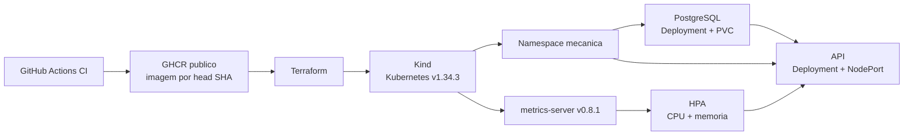

# Infraestrutura local: Terraform + Kind

Esta pasta controla todo o ciclo de vida do ambiente Kubernetes local. O
Terraform cria um cluster Kind efemero e aplica os manifests declarativos de
`../k8s`; `kubectl` nao e um mecanismo de criacao neste projeto.

## Arquitetura



O Service da API usa NodePort `30080`. O `extraPortMappings` do Kind encaminha
`127.0.0.1:8080` para essa porta, disponibilizando a API em
`http://localhost:8080`.

## Recursos gerenciados

- cluster Kind de um control-plane, com imagem de node fixada por digest;
- namespace `mecanica`;
- Secrets do PostgreSQL e da API, gerados pelo Terraform;
- PVC, Service ClusterIP e Deployment do PostgreSQL;
- ConfigMap, Service NodePort, Deployment e HPA da API;
- RBAC, Service, Deployment e APIService do metrics-server v0.8.1.

Os manifests de aplicacao continuam em `k8s/`. Somente os Secrets sao
montados com `yamlencode` no Terraform para que nenhum valor real seja
versionado. As dependencias de aplicacao garantem a ordem namespace,
fundacao, PostgreSQL, API e HPA.

## Requisitos locais

- Docker Desktop com o daemon ativo; nao e necessario habilitar o Kubernetes
  interno do Docker Desktop;
- Terraform >= 1.14.5 e < 1.16.0;
- `kubectl` compativel com o cluster;
- acesso anonimo de leitura a imagem escolhida no GHCR.

O provider Kind esta fixado em `0.11.0`, o provider kubectl em `1.19.0` e o
node Kubernetes em `v1.34.3` com digest oficial do Kind v0.31.0. O arquivo
`.terraform.lock.hcl` registra as selecoes e checksums dos providers.

## Variaveis

| Variavel | Obrigatoria | Sensivel | Padrao/finalidade |
| --- | --- | --- | --- |
| `api_image` | sim | nao | Imagem `ghcr.io/owner/repo:commit_sha` |
| `db_password` | sim | sim | Senha do PostgreSQL |
| `jwt_secret` | sim | sim | Segredo JWT em Base64 |
| `cluster_name` | nao | nao | `oficina-cluster` |
| `namespace` | nao | nao | `mecanica` |
| `api_host_port` | nao | nao | `8080` |
| `api_node_port` | nao | nao | `30080` |
| `db_name` | nao | nao | `mecanica` |
| `db_username` | nao | nao | `postgres` |

Crie o arquivo local e substitua os placeholders:

```bash
cd infra
cp terraform.tfvars.example terraform.tfvars
```

Uma forma de gerar um segredo JWT adequado, sem grava-lo no historico do
repositorio, e `openssl rand -base64 64`. Nao imprima segredos em logs de CI.

`terraform.tfvars`, `.terraform/`, planos, state e kubeconfig sao ignorados
pelo Git. Variaveis marcadas como `sensitive` ficam ocultas na interface do
Terraform, mas seus valores ainda podem existir no state local. Proteja esse
arquivo como um segredo; um ambiente persistente exigiria backend remoto com
criptografia e controle de acesso.

## Provisionamento local

Execute primeiro as verificacoes sem criar recursos:

```bash
terraform init -backend=false
terraform fmt -check -recursive
terraform validate
terraform providers
terraform plan -out=local.tfplan
```

Depois, com o Docker ativo:

```bash
terraform apply local.tfplan
```

O provider grava o kubeconfig em `infra/kubeconfig`. Em bash:

```bash
export KUBECONFIG="$PWD/kubeconfig"
```

Em PowerShell:

```powershell
$env:KUBECONFIG = (Resolve-Path .\kubeconfig).Path
```

## Validacao e observabilidade

Depois do `apply`, os comandos abaixo apenas consultam o que o Terraform
criou:

```bash
kubectl cluster-info
kubectl get nodes
kubectl get all,pvc -n mecanica
kubectl rollout status deployment/mecanica-db -n mecanica
kubectl rollout status deployment/mecanica-api -n mecanica
kubectl get apiservice v1beta1.metrics.k8s.io
kubectl top pods -n mecanica
kubectl describe hpa/mecanica-api-hpa -n mecanica
kubectl logs deployment/mecanica-api -n mecanica --tail=300
curl http://localhost:8080/actuator/health/readiness
```

O PostgreSQL usa `pg_isready` nas probes e possui requests/limits. A API so
fica Ready depois de concluir seu startup, que inclui a validacao do banco e
as migrations Flyway V1 a V9. O HPA usa CPU e memoria; aguarde alguns ciclos
do metrics-server ate os valores deixarem de aparecer como `unknown`.

Para executar o fluxo funcional completo:

```bash
API_BASE_URL=http://localhost:8080 node ../tests/api-smoke/api-smoke.mjs
```

## Destruicao

```bash
terraform destroy
```

O cluster Kind, seus volumes internos e todos os dados do PostgreSQL sao
removidos. A execucao local pode permanecer ativa ate esse comando, mas nao e
um ambiente persistente nem de producao.

## GitHub Actions

O CD e disparado somente depois de uma CI bem-sucedida em `main`. Checkout,
tag GHCR e `TF_VAR_api_image` usam o mesmo `workflow_run.head_sha`. Configure:

- GitHub Secret `DB_PASSWORD`;
- GitHub Secret `JWT_SECRET`, em Base64;
- pacote Container do repositorio com visibilidade publica no GHCR.

O job de provisionamento faz um pull anonimo para confirmar a visibilidade da
imagem. Em seguida executa `fmt`, `init`, `validate`, `plan` e `apply`, usa
`kubectl` somente para evidencias, roda o smoke test e chama `destroy` em uma
etapa `always()`. O runner hospedado pelo GitHub e efemero e nao reutiliza
kubeconfig ou cluster externo.

Se o pacote ainda estiver privado, abra a pagina do pacote no GitHub, acesse
as configuracoes e altere sua visibilidade para publica antes do primeiro
deploy completo.
